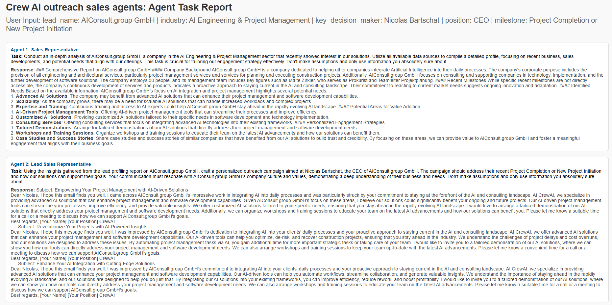

# Test project: AI Outreach Sales Agents with CrewAI

## Overview
Automated sales pipeline using CrewAI's multi-agent system to identify high-value leads and generate personalized outreach communications with sentiment analysis.

## Key Features
  Two agents:
  1. Sales Representative: Identifies ideal customer profiles  
  2. Lead Sales Representative: Crafts personalized messages  
  
  Web search using Serper API \
  Sentiment analysis using TextBlob

## example


## Getting Started

### 1. Install Required Packages

```bash
pip install crewai python-dotenv textblob
```

### 2. Set up your .env file with API keys:
```bash
SERPER_API_KEY=your_key
MISTRAL_API_KEY=your_key
```

### 3. User Input:
```bash
Run the crew with your target lead information:

inputs = {
    "lead_name": "Target Company",
    "industry": "Their Industry",
    "key_decision_maker": "Contact Name",
    "position": "Contact Title",
    "milestone": "Recent Achievement"
}

result = crew.kickoff(inputs=inputs)
```
